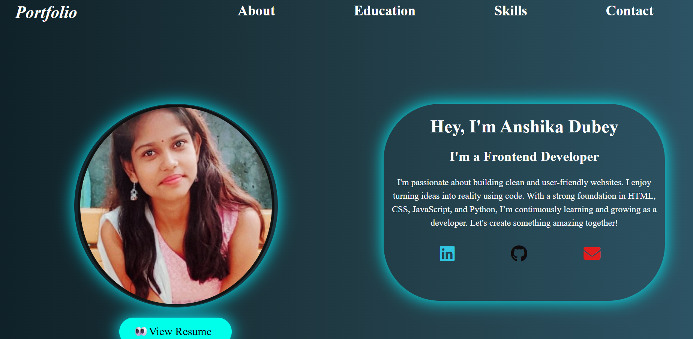
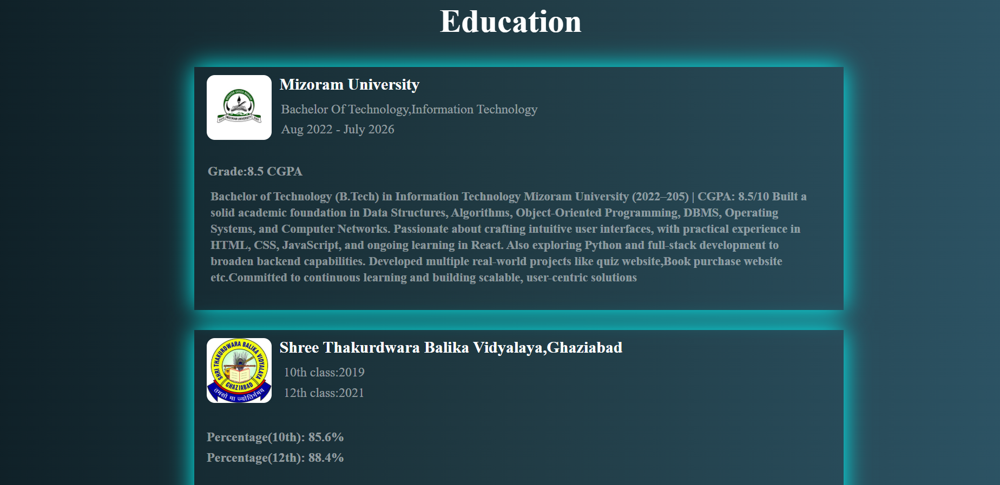
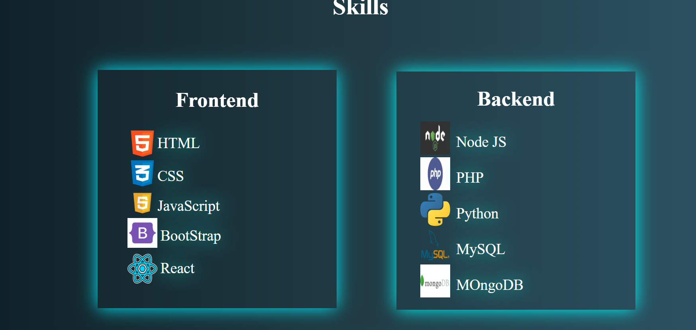
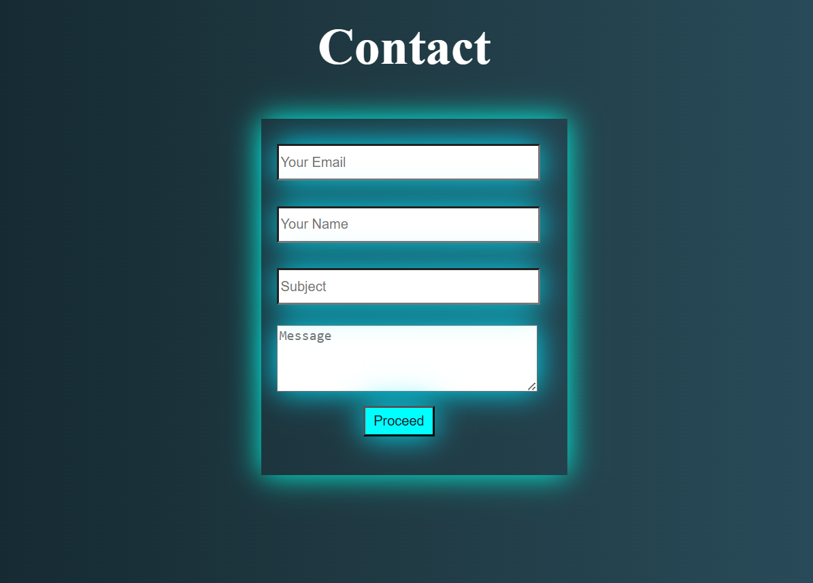

# 🌐 Personal Portfolio Website

A responsive and modern **personal portfolio website** built with **HTML5** and **CSS3**.  
This project showcases your **skills, projects, education, and contact information** in a clean, professional layout.

## 🔗 Live Demo
🎯 [View Live Project](https://anshi2003-sys.github.io/Portfolio/index.html#Education) 

---

## 📁 Project Structure
portfolio/
├── index.html            # Main HTML file
├── style.css             # Stylesheet for the portfolio
└── images              # Folder containing image assets


---

## 🚀 Getting Started

### 🖥️ View Locally

1. **Clone or Download** this repository.
    ```bash
    git clone https://github.com/your-username/portfolio.git
    ```
2. Navigate to the project folder:
    ```bash
    cd portfolio
    ```
3. Open the `index.html` file in your browser.

> ✅ No installation or dependencies required.

---

## 🛠️ Built With

- 🧱 HTML5  
- 🎨 CSS3  
- 💡 Responsive Design Principles

---

## 🖼️ Screenshots

| Home | Education | Skills | Contact |
|------|-----------|--------|---------|
|  |  |  |  |

---

> © All rights reserved.

---

